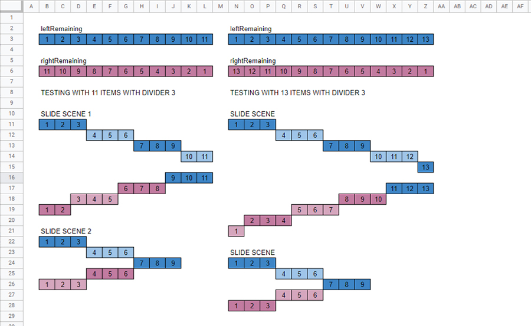
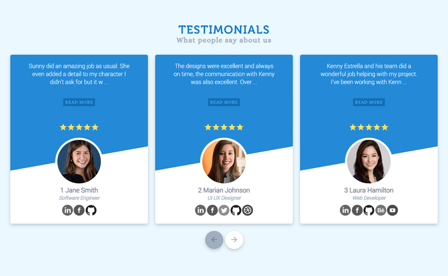

## Testimonial Carousel Component Fixed

This project is some sort of a **Testimonial Component** like many websites where you can slide left or right items. These items can be comments written by clients to services offered, it can have 5 ratings also, something like that.

This project actually was completed last year, July 2021 but it has plenty of bugs. Some fixes I did was around Sep 2021 but still it didn't fix the bug. It was hard to fix the code, since way back, I just coded the project directly after doing the design, and did not create some sort of planning or approach to solve the sliding process of the items. that's why it was not arranged. 

The repository of that project is [here](https://github.com/kennyestrellaworks/testimonial-carousel-2/).

When I re-worked this project, I started by planning the sliding process through showcasing boxes of numbers which represents the testimonial items, like below.

This way, it's easier to see some potential approach that can solve the sliding process. I also made this responsive, but the process of displaying items like 1, 2, or 3, depending on the browser's width was not done in SASS/CSS, it was done within the JavaScript code. Aside from that, for example, we slide right, then we are at item 6, whenever we resize the browser, we remain in that item. Then, if for example, we resize the browser to a smaller size, like it only shows 2 items where the default items shown is 3, the sliding process will be sliding 2 items when we slide right or left, as long as we have not slid at the first or the last item.

### Packages Installed

1. sass
2. live-server
3. autoprefixer
4. postcss
5. postcss-cli
6. npm-run-all
7. uglifycss

### Project Screenshot

Live Site URL: [Live Demo](https://kennyestrella-testimonial-carousel.netlify.app/)

### Used technologies
   

###  Used tools
 